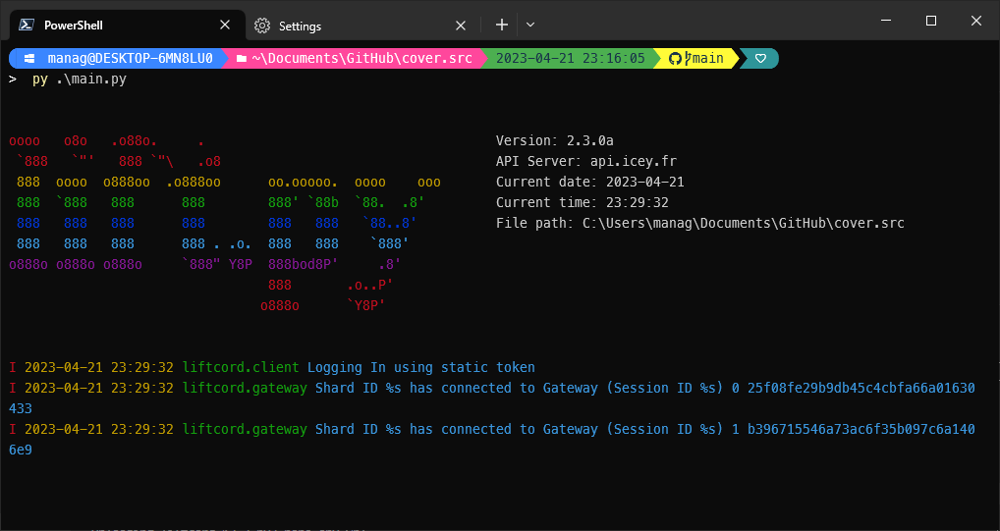

<p align="center"></p>

<h1 align="center" id="title">lift.bot</h1>


<p id="description">Best discord.py customized library. With easier usage less time to spend on reading docs and mobile status built in.</p>

<p align="center">

</p>

<h2>Project Screenshots:</h2>
<h2 style="color: 000000;"></h2>

#### Console Formatting



<h2>Installation Guide</h2>

- Install lift.bot library `pip install lift.bot`
- Create `main.py`

<h2>Examples</h2>

```py
import liftcord
from liftcord.ext import commands

bot = liftcord.Bot(command_prefix="?")

# Example command
@bot.command()
async def ping(ctx):
    await ctx.send("Pong!")

bot.login("token")
```
